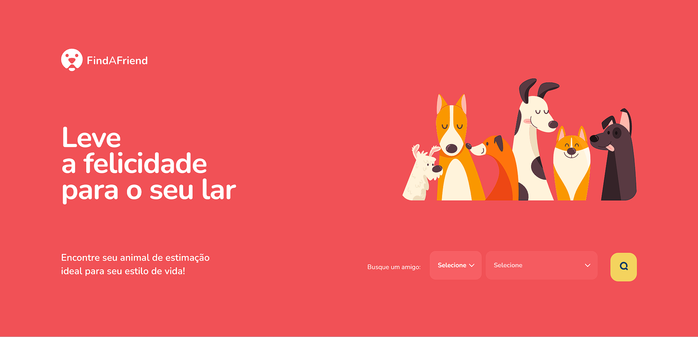

# Green Chain Challenge! - Find a friend 🐶

<br>

<p align="center">
  <a href="#-about-the-project">About the project</a> •
  <a href="#-technologies">Technologies</a> •
  <a href="#-getting-started">Getting started</a> •
  <a href="#-license">License</a>
</p>

<p align="center">
 
 
  
</p>

## 👩‍💻 About the project

The Green Chain Challenge is a project developed by Rocketseat for the community, with challenges that simulate real situations that you, the developer, will find in the job market!

 We will have fictitious companies with different profiles, deliveries by sprints and many challenges. Are you ready? 👀


/** To do - describe project functionality **/

## 🔖 Layout

You can view the project layout through the links below:

- [Layout in Figma](<https://www.figma.com/file/X7yi8BWql1UjniHlKxub2t/Find-A-Friend-(APP)-(Community)?node-id=1-2&t=XvR0dseuy7xKvpfh-0>)

> Remembering that you need to have a [Figma](http://figma.com/) account to access it.

## 🚀 Technologies

- [styled-components](https://styled-components.com/)
- [react-toastify](https://fkhadra.github.io/react-toastify/)
- [React hook form](https://react-hook-form.com/)
- [Zod](https://github.com/colinhacks/zod)

## 💻 Getting started

### Requirements

- [Node.js](https://nodejs.org/en/)
- [Yarn](https://classic.yarnpkg.com/) or [NPM](https://www.npmjs.com/) _(examples are with NPM)_
- [MySQL](https://www.mysql.com/) or [Docker](https://hub.docker.com/_/mysql) container with a MySQL server instance

**Clone the project and access the folder**

```bash
$ git clone https://github.com/leandrorodrigues00/gcc-find-a-friend-web && cd gcc-find-a-friend-web

```

**Follow the steps below**

```bash
# Install the dependencies
$ npm i

# Make a copy of '.env.example' to '.env'
# and set with YOUR environment variables.
$ cp .env.example .env


# Start the app
$ npm run dev
```

## 📝 License

This project is licensed under the MIT License - see the [LICENSE](LICENSE) file for details.

---

<p align="center">
  Made with 💜&nbsp; by  Leandro Rodrigues
</p>
