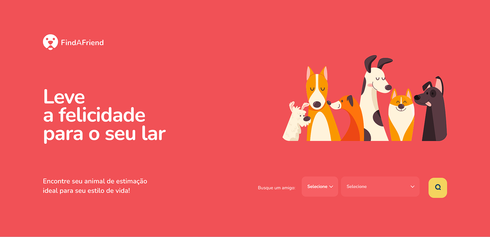
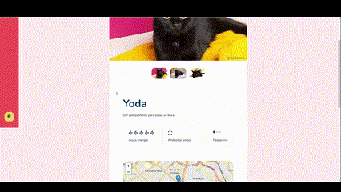

# Green Chain Challenge! - Find a friend 🐶

<br>

<p align="center">
  <a href="#-about-the-project">About the project</a> •
  <a href="#-technologies">Technologies</a> •
  <a href="#-getting-started">Getting started</a> •
  <a href="#-license">License</a>
</p>

<p align="center">
 
 
  
</p>

## 👩‍💻 About the project

The Green Chain Challenge is a project developed by [Rocketseat](https://rocketseat.com.br/) for the community, with challenges that simulate real situations that you, the developer, will find in the job market!

The "Find a Friend" project was created to streamline the pet adoption process. The platform allows users to locate dogs and cats available for adoption within their city, while providing customizable search filters based on preferred age, energy level, independence and size.

In addition, it also includes a dedicated section for animal welfare organizations to register their pets for adoption,which is accomplished through a login page and a route for authentication on the server, as well as a refresh token strategy.

**Note:** In order to use the application, you'll need to run both the server and the web application. Before launching the web app, make sure to install the API by following the steps provided in this repository:[Find A Friend API](https://github.com/leandrorodrigues00/gcc-find-a-friend-api). 

## 🖥 Project Demonstration


<br/>



[click here, see closer](https://gcc-find-a-friend-web-cs.vercel.app/) 😉 - (The site already has some pets registered for the city: SP - São Paulo.)


**Note:**
The web project has been deployed on [Vercel](https://vercel.com/), while the API has been deployed on [Render](https://render.com/). However, it is important to note that the free plan offered by Render has some limitations, including restrictions on memory and CPU usage. Additionally, the PostgreSQL database used in the deployment expires in 90 days and is automatically deleted, which means that the entire deployment process must be repeated.

If you encounter any issues while accessing the website, it is because I have not yet repeated the deployment process. As an alternative, you can download the web project and API and run them locally on your machine, which will work without any problems!

## 🔖 Layout

You can view the project layout through the links below:

- [Layout in Figma](<https://www.figma.com/file/X7yi8BWql1UjniHlKxub2t/Find-A-Friend-(APP)-(Community)?node-id=1-2&t=XvR0dseuy7xKvpfh-0>)

> Remembering that you need to have a [Figma](http://figma.com/) account to access it.

## 🚀 Technologies

- [styled-components](https://styled-components.com/)
- [react-toastify](https://fkhadra.github.io/react-toastify/)
- [React hook form](https://react-hook-form.com/)
- [Zod](https://github.com/colinhacks/zod)

## 💻 Getting started

### Requirements

- [Find A Friend API](https://github.com/leandrorodrigues00/gcc-find-a-friend-api). (Click on the link if you don't already have the API set up and running.)
- [Node.js](https://nodejs.org/en/)
- [Yarn](https://classic.yarnpkg.com/) or [NPM](https://www.npmjs.com/) _(examples are with NPM)_

**Clone the project and access the folder**

```bash
$ git clone https://github.com/leandrorodrigues00/gcc-find-a-friend-web && cd gcc-find-a-friend-web

```

**Follow the steps below**

```bash
# Install the dependencies
$ npm i

# Make a copy of '.env.example' to '.env'
# and set with YOUR environment variables.
$ cp .env.example .env


# Start the app
$ npm run dev
```

## 📝 License

This project is licensed under the MIT License - see the [LICENSE](LICENSE) file for details.

---

<p align="center">
  Made with 💜&nbsp; by  Leandro Rodrigues
</p>
